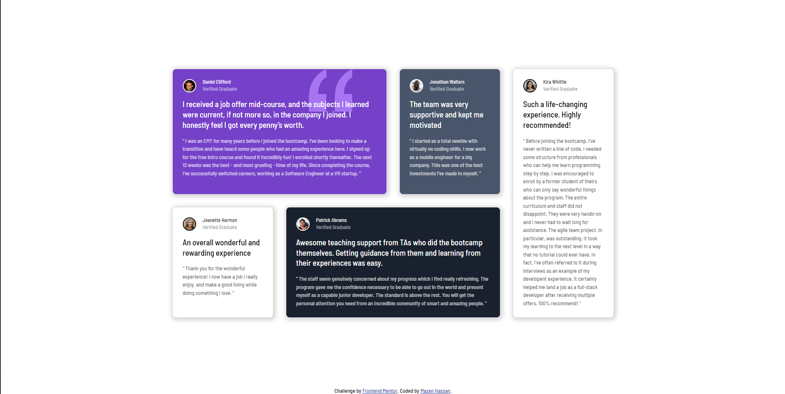
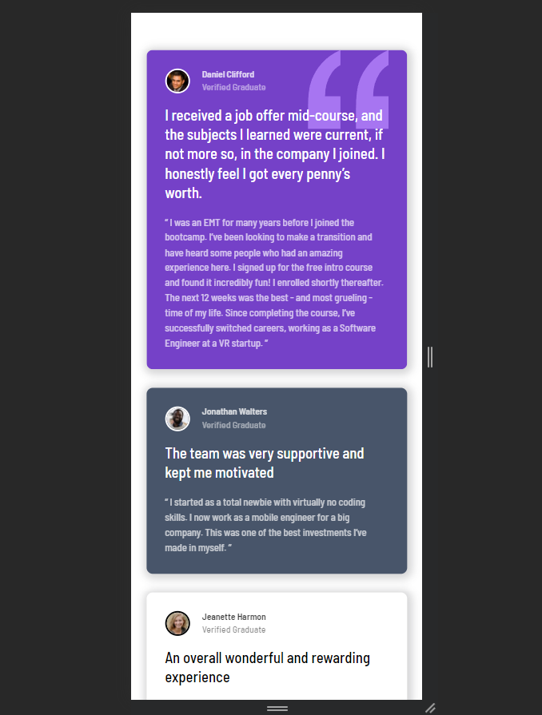

# Frontend Mentor - Testimonials grid section solution

This is a solution to the [Testimonials grid section challenge on Frontend Mentor](https://www.frontendmentor.io/challenges/testimonials-grid-section-Nnw6J7Un7). Frontend Mentor challenges help you improve your coding skills by building realistic projects. 

## Table of contents

- [Frontend Mentor - Testimonials grid section solution](#frontend-mentor---testimonials-grid-section-solution)
  - [Table of contents](#table-of-contents)
    - [The challenge](#the-challenge)
    - [Screenshot](#screenshot)
    - [Links](#links)
    - [Built with](#built-with)
    - [What I learned](#what-i-learned)
    - [Continued development](#continued-development)
    - [Useful resources](#useful-resources)

### The challenge

Users should be able to:

- View the optimal layout for the site depending on their device's screen size

### Screenshot






### Links

- Solution URL: [Add solution URL here](https://www.frontendmentor.io/solutions/testimonial-grid-using-sass-sRnHdyNU8w)
- Live Site URL: [Add live site URL here](https://testimonial-grid-section-wine.vercel.app/)

### Built with

- Semantic HTML5 markup
- CSS custom properties
- Flexbox
- CSS Grid
- Mobile-first workflow
- [Styled Components](https://sass-lang.com/) - For styles

### What I learned

What I learned in this project:

- How to stop adding unnecessary <div> and make life easier while styling.
- Adding specificity to element classes and reduce the usage of elements only selector, this provides better readbility and easy targetting.
- Having a shared class more often for same styles can improve structure and provide cleaner code.
- Using gap especially for Grid layout is one go trick instead of manual margin. 

```css
/* I used MDN documentation for guidance on background-position and how to slightly move it to the desired placement */
.card1 {
  background-image: url(../images/bg-pattern-quotation.svg);
  background-repeat: no-repeat;
  background-position: top right 10%;
}
```


### Continued development

- In future projects, I want to get more familiar with using background attributes like position, size, and repeat. Having a more complex background setup would require tweaking of these 3 attributes, which are different from the usual setup for basic backgrounds.
- Another property I used on a previous project was mix-blend-mode for blending an image with its background color of choice. I will definitely need to expand my knowledge on it too.


### Useful resources

- [Example resource 1](https://developer.mozilla.org/en-US/docs/Web/CSS/background-position) - I followed this MDN to properly position quotation image on the card.

